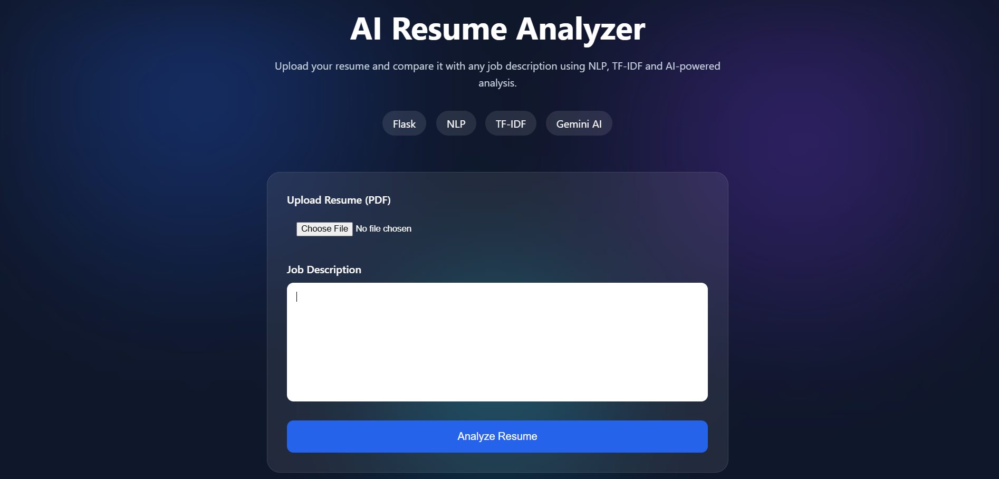

# AI Resume Analyzer

AI Resume Analyzer is a Flask-based web application that helps job seekers evaluate how well their resumes match a job description. The application extracts text from uploaded PDF resumes, processes the content using NLP techniques, and calculates an ATS-style match score using TF-IDF and cosine similarity. It also integrates Google's Gemini API to generate AI-powered feedback and resume improvement suggestions.

## Features

* Upload PDF resumes
* Extract and process resume text
* Compare resumes with job descriptions
* Generate ATS-style match scores
* AI-powered resume analysis using Gemini API
* Modern dark-themed SaaS-inspired UI
* Secure API key management using environment variables

## Tech Stack

* Python
* Flask
* HTML, CSS
* NLP
* Scikit-learn
* TF-IDF & Cosine Similarity
* Google Gemini API

## Future Improvements

* Skill extraction and gap analysis
* Resume keyword recommendations
* Multiple resume comparisons
* Job role recommendations
* Advanced ATS scoring system
* ## Screenshot

